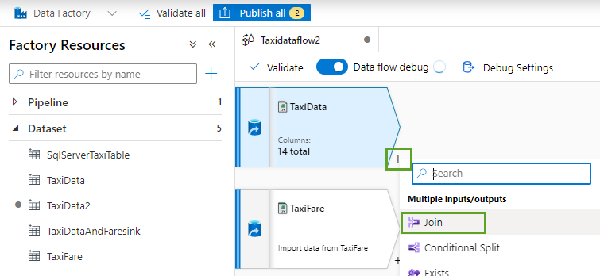

## Modern Data Estate
# Lab - Azure Data Factory code free data transformations using Data Flows

In the Azure Portal click the search bar in the top and type "Data Factories"
then click on the data factory you created in the earlier lab.

Open the Data Factory studio.

Look around the Data Factory interface and become familiar with the menu items on the left.

Let's start by setting up a new Linked Service. A linked service is simply a path and set of credentials so Data Factory can find your source of data.

Pick Azure Data Lake storage Gen2.

Pick the storage account you created earlier by using your subscription details.

You should now have a new Linked Service set up.  You will use this for any data set in your data lake
so you won't have to set up another Linked Service for this particular source again.  You will create
other Linked Services for things like a SQL or Oracle database etc.

Next click on the Author menu item and under Data Flows click the three dots (ellipses) and pick New Data Flow.

Before we do any authoring let's turn on Data flow debug. You can leave the default settings and click ok. This will take a few minutes to spin up a cluster in the background.

You can name your Data Flow by filling in the Name property under the Properties window on the top right. 

Click the Add Source box and then give your data set a name.  Name it TaxiData and click the New button.

Pick Azure Data Lake Storage Gen2 and press Continue.

Pick CSV and press continue.

Name your data set and pick the Linked Service you created earlier.  Now browse to the Trip_Data.csv file
in your data lake. Pick the first row as header option.

In the Data source settings press the Projection tab and click the Detect Data Types option.

Now do the same thing again adding a data source for the Trip_Fare.csv data.

If you haven't already, turn on the Data flow debug option.

Now click the small plus (+) sign next to your TaxiData data source and pick the Join transformation. 

Pick the join settings as below.

Click the Preview tab and if necessary the refresh button to preview the joined data.

Now add a filter transformation.

Name your filter and open the Expression Builder.

In the input schema options pick the column trip_distance and then add > 2 and click the Save & Finish button.

You can optionally click the Data Preview tab to look at the results. 

Now let's add a Derived Column transformation. Add a formula like this below. 
Code: `iif(rate_code == 1, 'Basic','Standard')` 

Look at the Data Preview. Scroll to far right and look at the new derived column.
If you get an error related to data type make sure you defined the rate_code column as an integer in the
earlier step. If not, you can put single codes around the 1. 

Optionaly add an Aggregate.  Pick rate_code as the column to group by and then in the Aggregate section add a new column called SumOfFareAmount and add 
an expression sum({fare_amount}). If you get an error make sure the data source for fare_amount is defined as an integer. 

Optionally add a Sort transformation and pick a column to sort on.

Finally add a Sink transformation. This is the destination of your data flow activity. 
Next to the final activity you have on the data flow, click the plus (+) icon and add a Sink activity

For the sink create a new dataset and make it a SQL Server one as show below.

You will need to create a new Linked Service for this.

Press the Test Connection link. If you get an error, click the error and you may need to go to the Azure SQL DB server and add
your IP address you see in the error. 

You will also need to set the "Allow Azure services and resources to access this server" to Yes.

Finally press create.

The final step of the new data set\linked service set up is to pick the name of your new table you want to populate.

Press the Publish button on the top of the screen to commit your changes. Optionally you can press
the Validate button on top left of your data flow to make sure eveything is working well.

Now all you need to do is set up a pipeline to run your data flow.  Do this by
going to the Author tab and next to the Pipeline category click the three dots ellipses and pick New Pipeline.

You can Publish one more time to save your changes and then to run the pipeline\data flow on demand click the Debug button in the pipeline. 
Click the eyeglasses icon at the bottom where you pipeline is queued or running. 

Now you can click each activity to see the status.  A green bar on the top of the activity means that it was successful. 

To see the results in SQL Server you don't need to use SQL Server Management Studio or Azure Data Studio if you 
don't have them installed. Instead, navigate back to the SQL Server in the Azure portal and from the main overview
page click on the database to go to that database.

Then click the Query Editor option on the left menu (aka blade).

[Back to main page of tutorial](https://github.com/krepko7/Modern-Data-Estate)