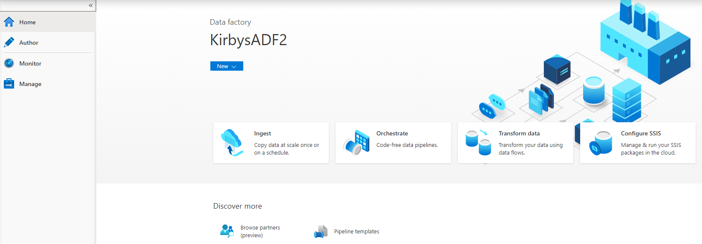

## Modern Data Estate
# Lab - Azure Data Factory code free data transformations using Data Flows

In the Azure Portal click the search bar in the top and type "Data Factories"
then click on the data factory you created in the earlier lab.

Open the Data Factory studio.

Look around the Data Factory interface and become familiar with the menu items on the left.

Let's start by setting up a new Linked Service. A linked service is simply a path and set of credentials so Data Factory can find your source of data.

Pick Azure Data Lake storage Gen2.

Pick the storage account you created earlier by using your subscription details.

You should now have a new Linked Service set up.  You will use this for any data set in your data lake
so you won't have to set up another Linked Service for this particular source again.  You will create
other Linked Services for things like a SQL or Oracle database etc.

Next click on the Author menu item and under Data Flows click the three dots (ellipses) and pick New Data Flow.

You can name your Data Flow by filling in the Name property under the Properties window on the top right. 

Click the Add Source box and then give your data set a name.  Name it TaxiData and click the New button.

Pick Azure Data Lake Storage Gen2 and press Continue.

Pick CSV and press continue.

Name your data set and pick the Linked Service you created earlier.  Now browse to the Trip_Data.csv file
in your data lake. Pick the first row as header option.

Now do the same thing again adding a data source for the Trip_Fare.csv data.

Also, turn on the Data flow debug option.

[Back to main page of tutorial](https://github.com/krepko7/Modern-Data-Estate)