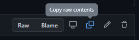

## Modern Data Estate
# Lab - Upload file to storage account

In this lab we are retriving two text files from above and saving them locally on our PC so we can upload to your Azure Data Lake storage account.

- Step 1 - Click on the trip_data.csv above and then click the "Copy raw contents" button on the right. Then open the text editor of your choice and save the file as a .csv locally on your computer. Name it trip_data.csv. Once you have done that remember in GitHub how to navigate back to this page. The graphic below this next one shows you how to click the link to get back.

- Step 2 - Do the same with the above trip_fare.csv and copy the contents of Taxi fare data to a text editor of your choice and save the file as trip_fare.csv.

- Step 3 - [Upload the above files you just saved locally to storage account using the Azure Portal](https://docs.microsoft.com/en-us/azure/storage/blobs/storage-quickstart-blobs-portal)

- Optional Step - If you are doing the lab "ADF and Data Flows with MoviesDB file" the file we will use is MoviesDB.csv. To retrieve the file from GitHub, copy the contents to a text editor of your choice to save locally as a .csv file. 
  The file can be found [here](https://raw.githubusercontent.com/djpmsft/adf-ready-demo/master/moviesDB.csv).

- Optional Step - If you are doing the lab "Create a Power BI report directly from Azure Data Lake file CarInventory file" copy this file [link](https://raw.githubusercontent.com/krepko7/Modern-Data-Estate/main/labs/Lab2%20-%20Copy%20file%20to%20storage%20account/CarInventory.csv?token=AEX6LLP6DSYH77DNUXLXHO3BHOS44) and copy the Car Inventory contents in to a text editor of your choice and save the file as a .csv locally on your computer. 

[Back to main page of tutorial](https://github.com/krepko7/Modern-Data-Estate)

