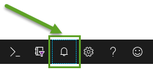

## Modern Data Estate
# Lab - Set up Azure Data Factory

In the Azure Portal click the search bar in the top and type "Data Factories"

Then click the Data Factories option and on the next screen click the Create button at the top left"

Fill in fields similar to below.

Click next and pick the "Configure Git Later" option.  Click "Review + Create" to create your data factory.

Remember when creating new resources in Azure to check the notifications bell icon at the top of the Azure Portal. It will tell you when reources are ready and allow you to quickly access them. 

Once your data factory is set up open it in Azure. 

Here is a screen shot of the initial ADF splash page. 

[Back to main page of tutorial](https://github.com/krepko7/Modern-Data-Estate)