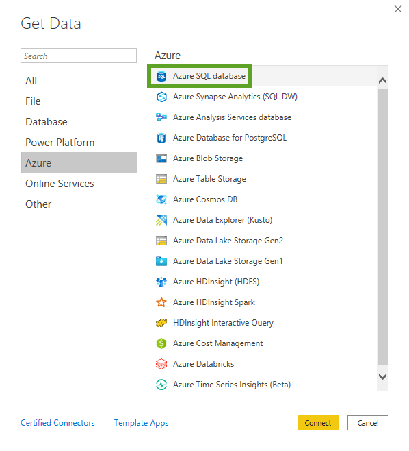
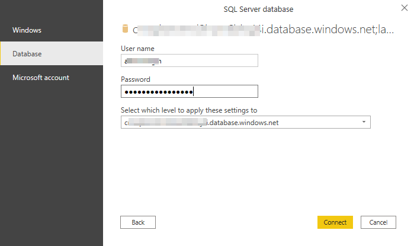
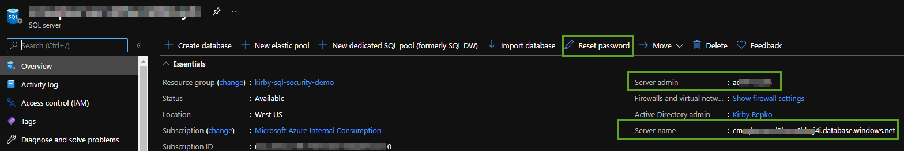
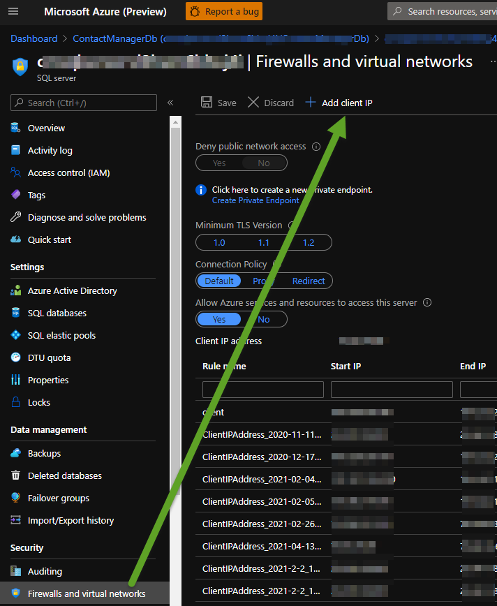
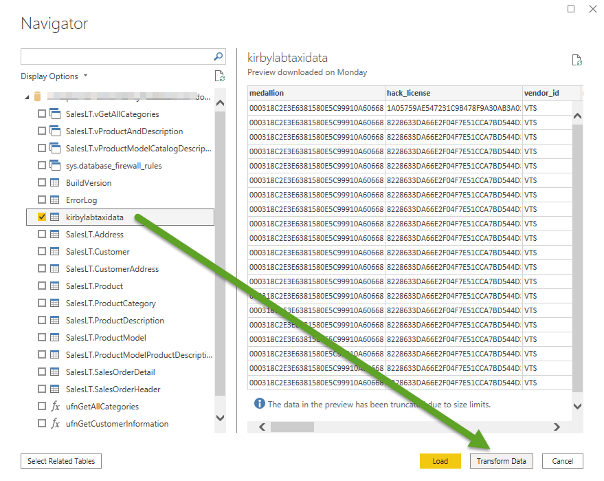
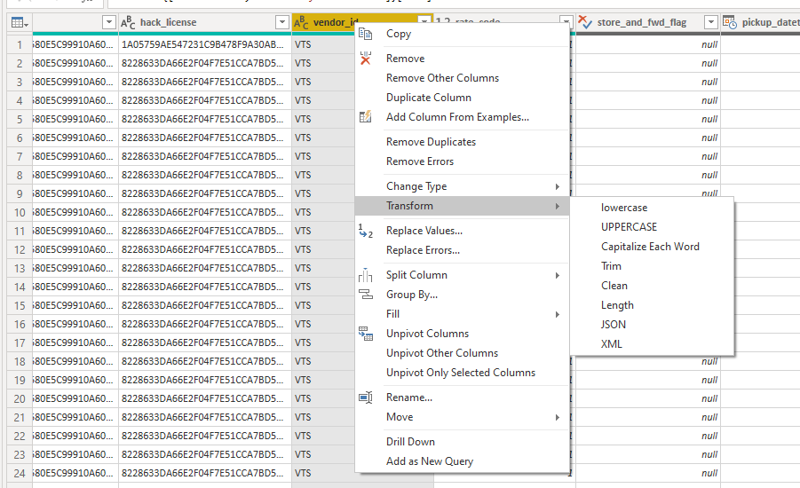
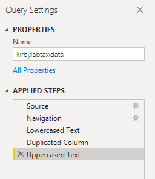
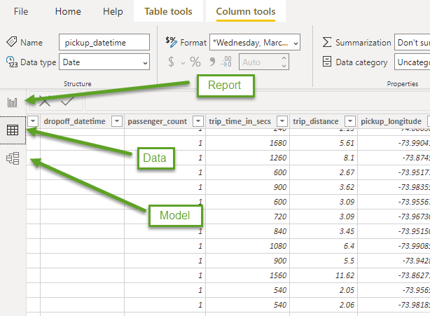
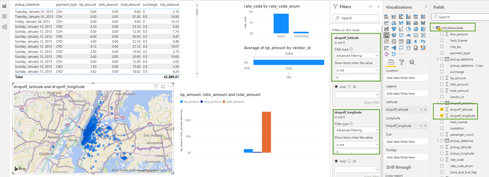

## Modern Data Estate
# Lab - Create Power BI Report from Azure SQL Datsbase

Open the Power BI Desktop application on Windows PC. On the first page
click the Get Data link and then pick Azure as the category on the left
and then Azure SQL Database as the source.

Click the Database tab on the left and then enter the name of your Azure SQL Database Server and database name.

If you need to find the SQL ID or reset the password go to the Azure Portal and find 
the SQL Server and you will see this screen with options to reset password.

If you get a firewall error add your client IP address in the Azure SQL Database 
in the Azure portal.

Click your SQL table and preview the data. Then click the Transform Data button to
start your transformations. 

Now you can right click on a column and pick a transform option. You can also split, pivot, remove duplicates etc.

Remember any transformation step you do is being tracked so it can be replayed next time you refresh
the data. You can look at these steps and delete or change the order of them by looking at
the Applied Steps section on the right. 

!!! Challenge. Change the column data type of pickup_datetime and dropoff_datetime columns to datatime. !!!

Finally press the Close and Apply button to import the data into the Power BI data model. 
Now you can view the data, the model and create a report\dashboard by clicking the buttons
on the top left.  

Now click on your table fields and change the report visuals, set filters etc. to create your report.

[Back to main page of tutorial](https://github.com/krepko7/Modern-Data-Estate)