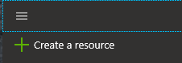
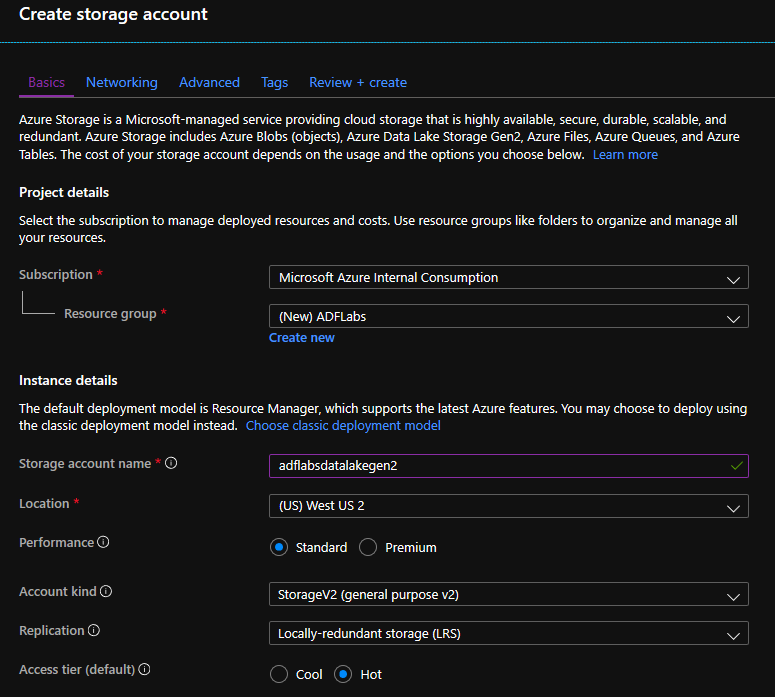
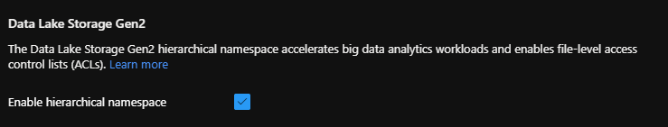
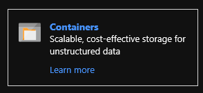
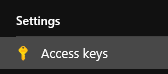

## Modern Data Estate
# Lab 1a - Set up Data Lake Storage

Create a Storage Account for your Data Lake.  Go to portal.azure.com and click the Create Resource menu item from top left menu.

Then pick the Storage category and then click on Storage Account.  Fill in fields for the first screen similar to below.
Leave other screens as default for lab purposes.

In the Advanced section make sure to pick the Enable hierarchical namespace option.

Now go to your newly created storage account and click the Containers option.

From here click the +Container icon at the top and give a lower case name, leave the public access level to "Private" and click OK.

Go to the Storage Account "blade" in Azure portal and clicke the Access keys menu item under the Settings section.
Just be familiar with this section in case you need the access keys later.

