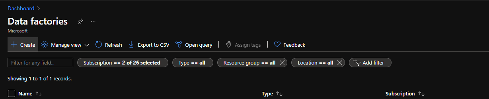
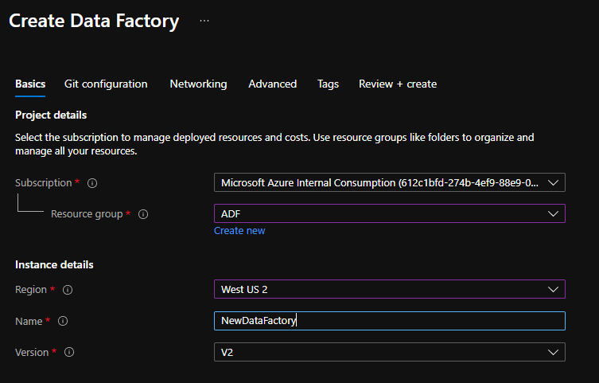
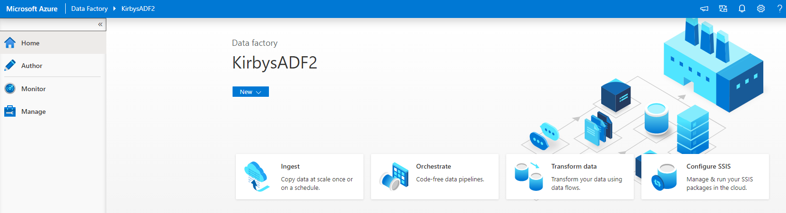

## Modern Data Estate
# Lab 1b - Set up Azure Data Factory

In the Azure Portal click the search bar in the top and type "Data Factories"

Then click the Data Factories option and on the next screen click the Create button at the top left"

Fill in fields similar to below.

Click next and pick the "Configure Git Later" option.  Click "Review + Create" to create your data factory.

Remember when creating new resources in Azure to check the notifications bell icon at the top of the Azure Portal. It will tell you when reources are ready and allow you to quickly access them. 

Once your data factory is set up open it in Azure. Click the Author and Monitor button.

Here is a screen shot of the initial ADF splash page. Click the Author pencil on left.

Click the Connections menu item at the bottom left and then click New.

Pick the Database category and then pick SQL Server.

The name of your linked service is important since you will end up with many of these and will want to know what linked service points to what data source.
You will later create data sets based on these linked services. 
Leave the Connect Via integration runtime (IR) drop down as "autoresolveintegrationruntime".  See more about IR's at https://docs.microsoft.com/en-us/azure/data-factory/create-azure-integration-runtime

Make sure to test the connection before you proceed.

