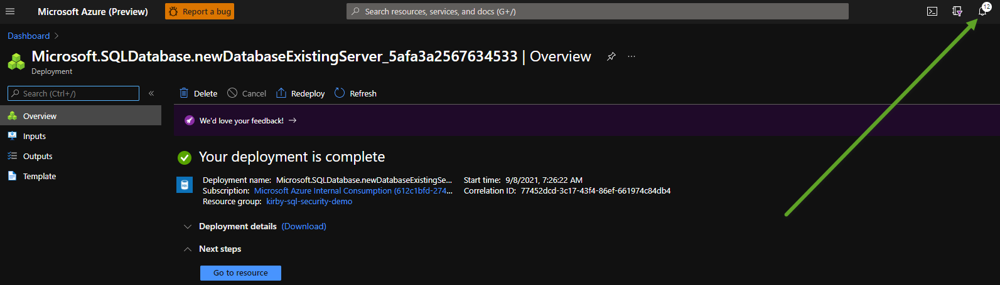

## Modern Data Estate
# Lab 3 - Set up an Azure SQL Database

>This is the fun part :smile:

In the Azure Portal (portal.azure.com) type "SQL databases" in the search bar at the top of the page then click the SQL Databases option in the search results.

&nbsp;

Now press the Create button at the top left.

&nbsp;

Use an existing Resource Group or create a new one.  A Resource Group is simply a logical way to group items in Azure.
Also, if this is your first SQL DB then you will create a new "Server" in the Database details section.  You can have one "Server" and many
SQL DB's so you only have to create the server once.  This isn't an actual server, it's a way to organize connections, firewalls, networking etc.
Pick No for the SQL elastic pool option.
Before pressing "Next..." click the Configure Database link.

&nbsp;

In the Configure Database page pick the Save Money option if you already own a SQL Server license.  You can use the sliders at the bottom of
this page to pick the number of vCores and database size. For this lab a 2 vCore with 5 GB should be fine. Click the apply button.

&nbsp;

Pick the Add current client IP address in the networking section.

&nbsp;

Now click the Additional settings section at the top tab and pick "Sample" as the Use existing data option.

&nbsp;

You can now click the Review + create button.

&nbsp;

Review the settings and price details and then press the Create button.
Once your database is ready you should see a screen like this. If you don't, click the Bell icon at the top right to see
the status of your database.

&nbsp;

