## Modern Data Estate
# Lab 4 - Create Power BI Report from Data Lake File

In the Azure Portal (portal.azure.com) find your storage accounts.

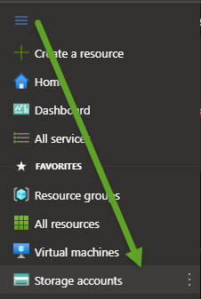

Then go into the Access Control (IAM) screen and add a role assignment.

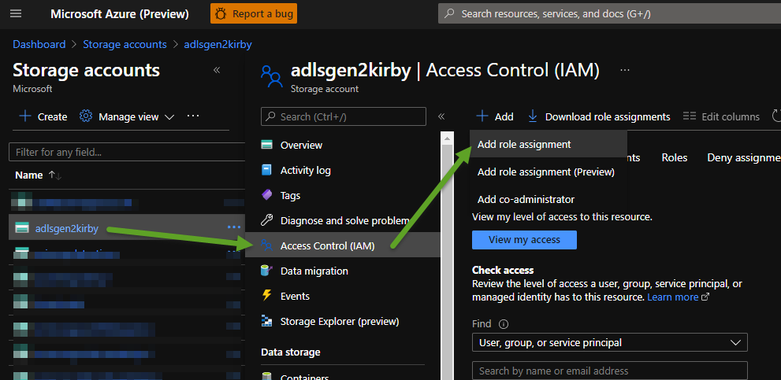

Add the role "Storage Blob Data Reader" to the Power BI Service ID and click the Save button.

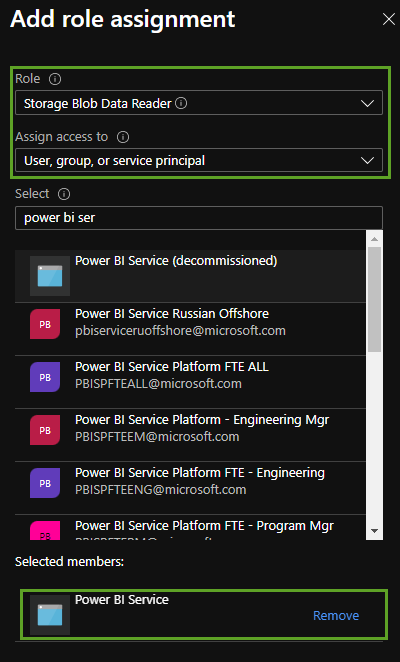

In your storage account get the Data Lake Storage endpoint URL from the Settings, Endpoints menu.

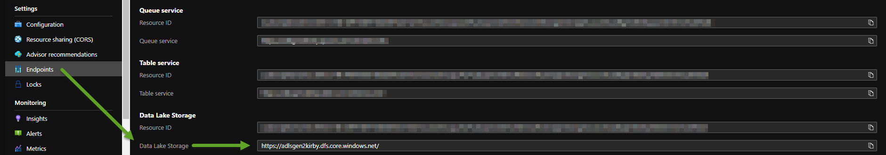

Now run Power BI Desktop that was installed as part of your pre-requisite steps.

On first screen in Power BI Desktop click Get Data and then pick the Azure category and Azure Data Lake Storage Gen2

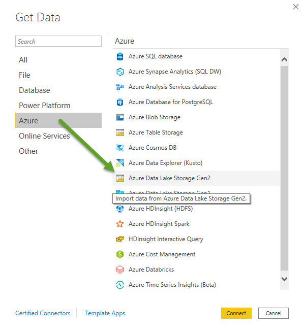

Put the URL from your Data Lake storage account and add the container (folder) name.  Green is the Storage Account URL from your endpoints.
Yellow is the container (folder) name and blue is the file name.
The file name is case sensitive.  Example:  https://adlsgen2kirby.dfs.core.windows.net/container1/CarInventoryTextOnly.csv

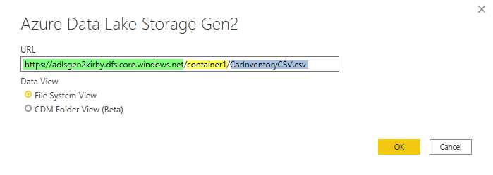

You will then login to Azure.  Once authenticated you should see a screen like this and you then click the "Transform Data" button.

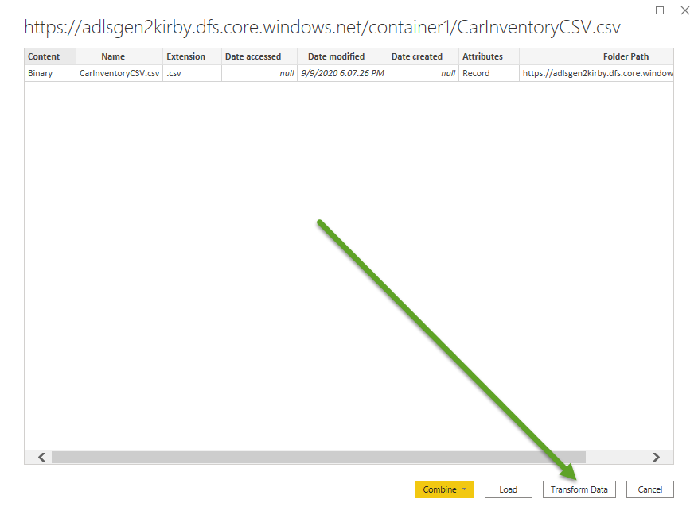

You then will click the Binary link as show below.

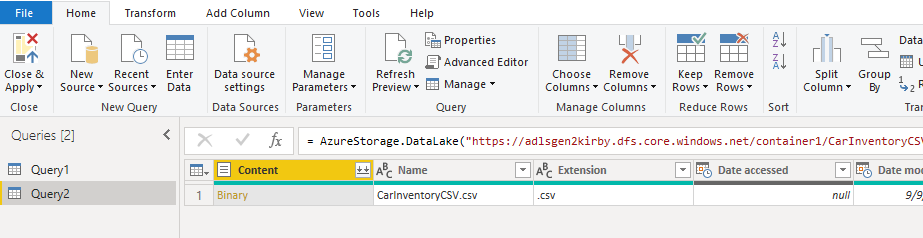

Now you can start to transform your data. Right click a column and then do things like split a column or transform etc. In this example we are splitting the "Make" column
into two columns.

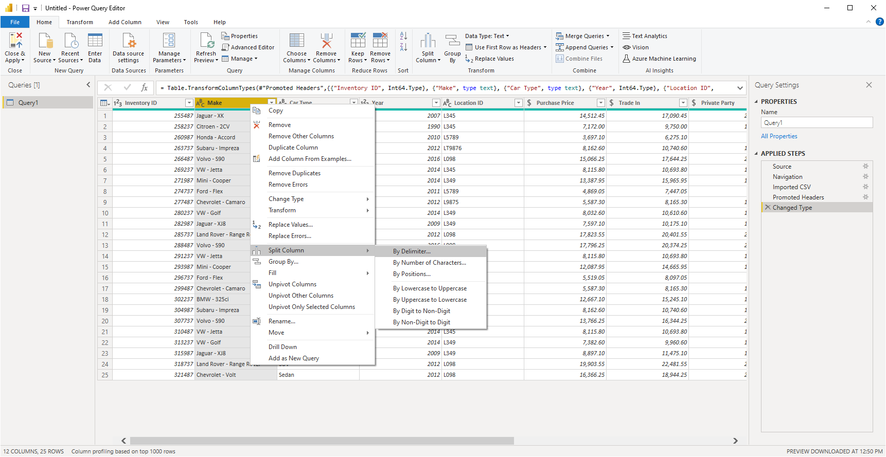

Pick the delimiter and then press OK.  You should now see the one column that transformed into two columns.

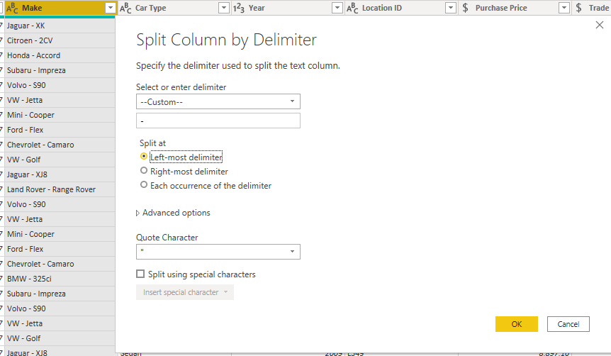

When finished press the Close & Apply button.

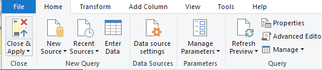

Click the upper left Data button in Power BI to see your data.

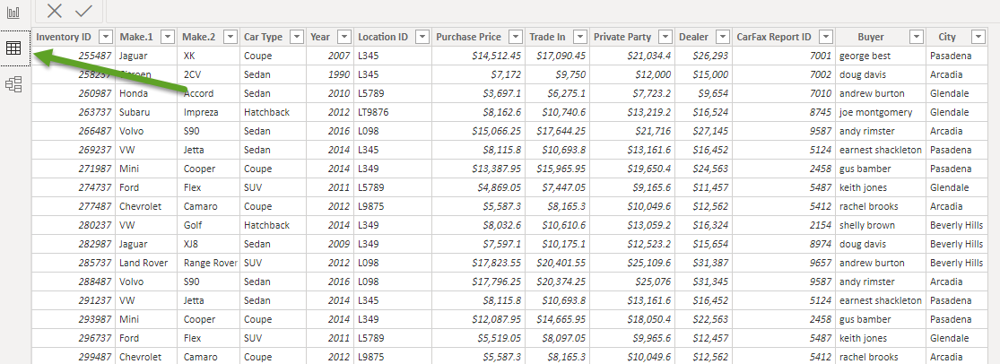

Next click the Report button on upper left menu and start creating a new report.  When finished, press the Publish button on top right menu to publish to the Power BI Service (PowerBI.Com)

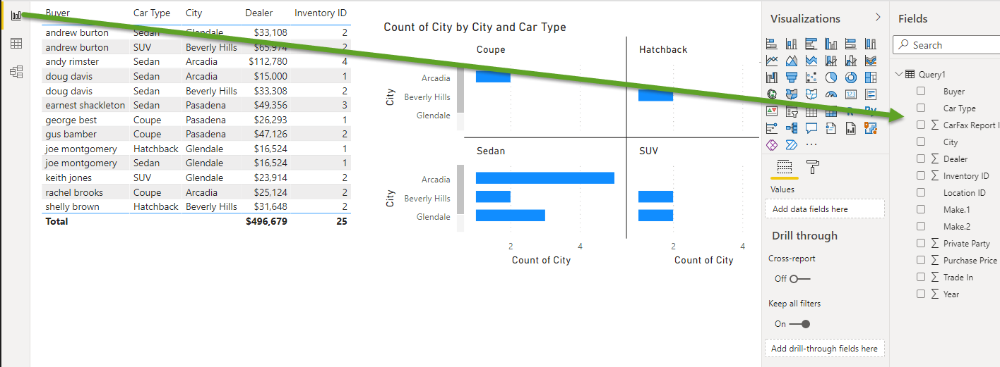